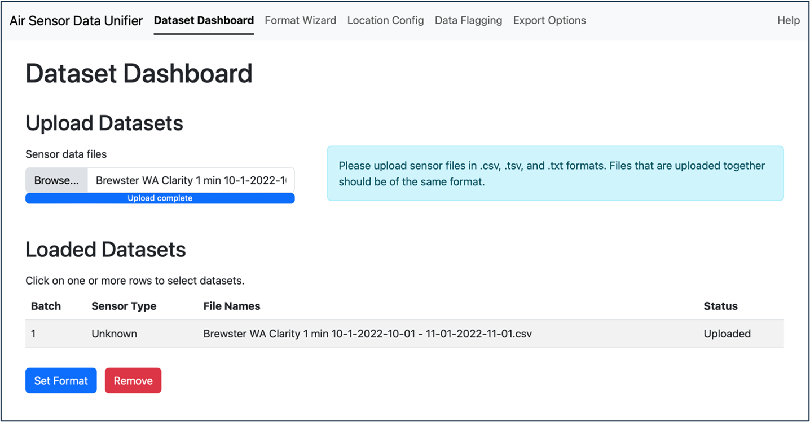

## Summary

An R-Shiny application has been developed that allows users to import text-based air sensor data, define the format of that data, do basic quality control, and export the data to standard formats. Format information can be saved for re-use to speed up processing of additional sensors of the same type.

## Statement of need

Poor air quality contributes to the burden of disease globally [@RN1]. Air quality measurements are critical to adequately protect human health [@RN2; @RN3]. In addition to conventional air monitors, air sensors are widely used for a variety of applications [@RN4; @RN5]. These sensors are often lower in cost and require less maintenance than conventional monitors allowing them to be deployed by more users. Many networks containing dozens or more sensors reporting data every few minutes or faster. Raw data reported by these networks can have issues that require careful analysis to produce credible processed data [@RN6]. Analyzing a wide variety of datasets can be challenging due to large data volume, variable formats, and unique features and issues requiring extensive data analysis skills.

## Overview

The Air Sensor Data Unifier (ASDU) in an R-Shiny application [@RN7; @RN8] that includes a dataset dashboard, format wizard, data check, data flagging, and export functionality.

## Dataset Dashboard

The Dataset Dashboard allows users to upload raw air sensor data files (Figure 1). It works with comma-separated values, tab-separated values, and plain text files (i.e., file extensions .csv, .tsv, and .txt). Files that are uploaded together should be of the same format.

## Format Wizard

Users can describe the format of their sensor data files. The first (optional) step is to define the data header row. Sensor data comes in many formats; the first row may contain column headers, the first few rows may contain a variety of meta data, or there may be no column headers. The Format Wizard displays the first 10 lines of the file and users can specify the header row and the column delimiter for the files. Next, the user can identify the data type and units for the data in each column and the timestamp formatting. When setting up a new sensor format, ASDU will try to detect the components of any timestamp column(s) and the user can adjust them as needed and specify time zone (Figure 2). Finally, the user can save the format information as a JavaScript Object Notation (JSON) file. This file can be loaded in future runs with data of the same format, so the user does not have to re-specify the format. Users can then use the data check step to scan the file and add the location.

## Data Flagging 

The Data Flagging page allows users to set up rules for checking the data (Figure 3). Flags can be set up for each data column in the dataset. There are five data flags that can be applied: 1) handling of a missing value, 2) below minimum value, 3) above maximum value, 4) repeated value for a user specified number of datapoints, and 5) outlier value by user-specified number of standard deviations away from the mean. Each flag has an identifier based on the data column's index (starting with 1) and the flag (letters A through E). This identifier is reported in a new “flags” column when the flags are applied to the dataset to identify which flags matched each record. The Data Flagging Summary will list how many records from the dataset were flagged, and how many records will be dropped and replaced when the data is exported. The user can export the dataset with or without the flagged data.

## Export Options 

The Export Options page allows the user to select how they want the data to be exported. ASDU can export data in the following formats: the Air Sensor Network Analysis Tool (ASNAT) Standard Format File [@RN9], Keyhole Markup Language (KML) (for use in Google Earth or Geographic Information System (GIS) programs), and the format used by Real Time Geospatial Data Viewer (RETIGO) (https://www.epa.gov/hesc/real-time-geospatial-data-viewer-retigo, last accessed February 20, 2025). Data averaging can also be applied to the file. The current output options are “raw” where no averaging is done, "hourly”, or “daily” (currently 24-hour averages in UTC). This allows sensor data to be reformatted and used for a variety of applications.

## Limitations

• The tool currently works with datasets where there is one row of data (any number of columns) per timestamp. In addition, data must be associated by column (e.g., PM2.5 data in column X). 

• The data must include a timestamp column and at least one observation column (ozone (O3), nitrogen dioxide (NO2), carbon monoxide (CO), particulate matter (PM), particle count, or meteorology data).

## Acknowledgements

This work was supported by EPA internal funding. Thank you to Sedona Ryan (UNC) and Eliodora Chamberlain (EPA R7) for their support. Thank you to those who provided input, example datasets, and testing feedback including: US EPA Amara Holder (ORD), Megan MacDonald (ORD), Ryan Brown (Region 4), Daniel Garver (R4), Chelsey Laurencin (R4), Rachel Kirpes (R5), Dena Vallano (R9), Laura Barry (R9), Nicole Briggs (R10), and Elizabeth Good (Office of Air Quality Planning and Standards); South Coast Air Quality Management District Wilton Mui, Vasileios Papapostolou, Randy Lam, Namrata Shanmukh Panji, Ashley Collier-Oxandale (former); Washington Department of Ecology Nate May; Puget Sound Clean Air Agency Graeme Carvlin; and New Jersey Department of Environmental Protection Luis Lim; and Desert Research Institute: Jonathan Callahan.

## Disclaimer

The views expressed in this paper are those of the author(s) and do not necessarily represent the views or policies of the US EPA. Any mention of trade names, products, or services does not imply an endorsement by the US Government or the US EPA. The EPA does not endorse any commercial products, services, or enterprises.

## References
